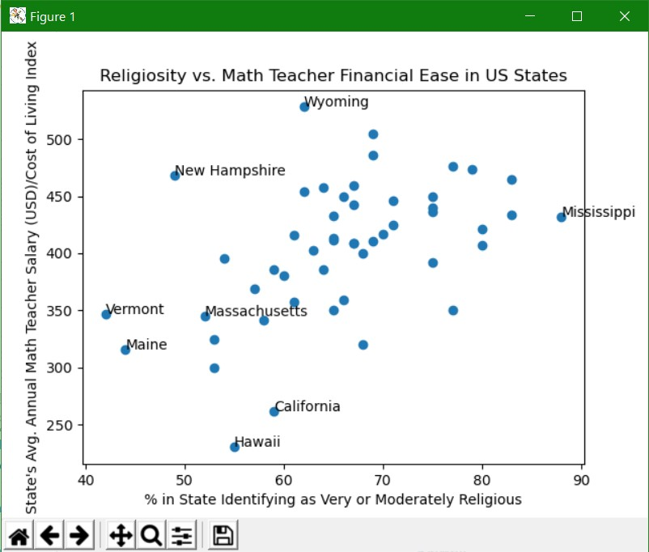

# What Is It?

This program scrapes the average math teacher salary, by state, from ziprecruiter.com; it then divides the salary by the cost of living index in the respective state, taken from worldpopulationreview.com; finally, it plots that dividend against religiosity by state.

# How Do I Use It?
Simply run grapher.py to graph the data. Note that grapher.py will automatically use salary_scraper.py to retrieve data about the average math teacher salaries by state.

# Contact Me
Did you encounter a bug in our application? Do you want to request a new feature? Have a funny meme for us?
Email me at djs.shuster@gmail.com.

# Sources
CoLData.csv is taken from worldpopulationreview.com(https://worldpopulationreview.com/state-rankings/cost-of-living-index-by-state).
Data for math teacher salaries by state is scraped from ziprecruiter.com(https://www.ziprecruiter.com/Salaries/What-Is-the-Average-Math-Teacher-Salary-by-State).
religionByState.csv is taken from statista.com (https://www.statista.com/statistics/221454/share-of-religious-americans-by-state/).
